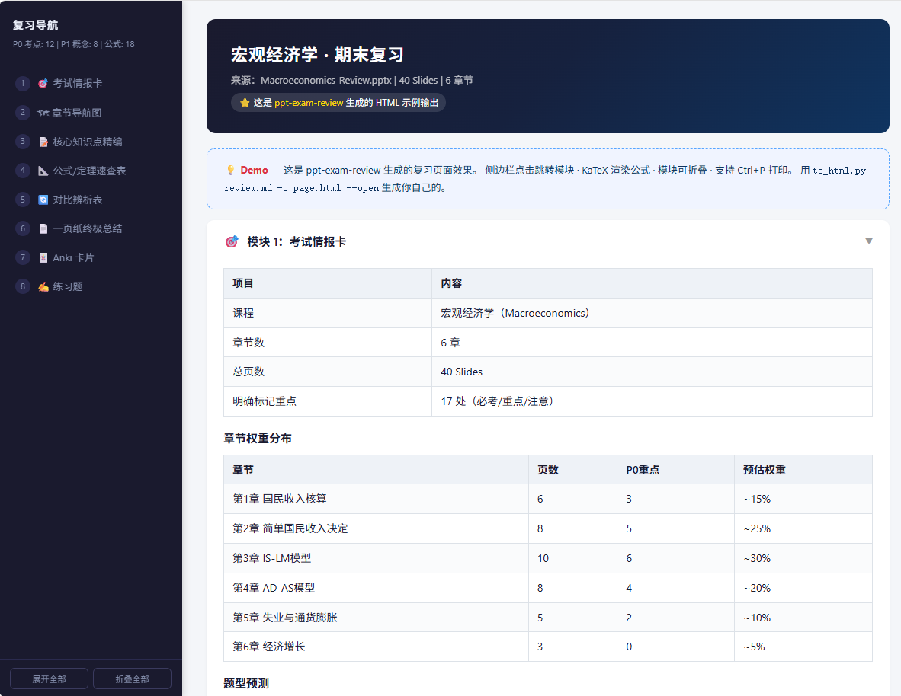
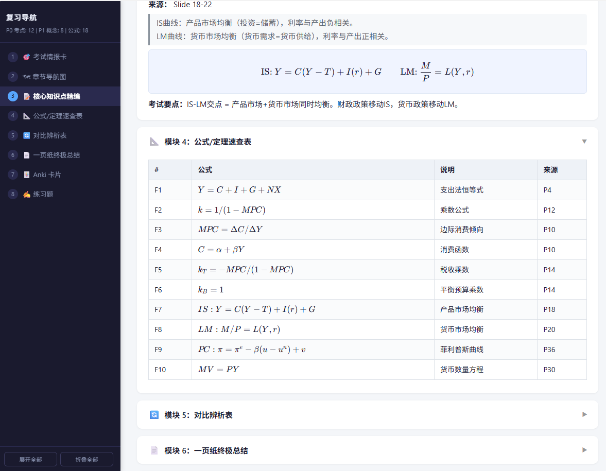

# 📚 PPT Exam Review — Claude Code Skill

> **Turn your exam review slides into structured, printable study materials — right inside Claude Code.**
>
> Parse `.pptx` / `.pdf` / scanned documents → generate core notes, formula sheets, one-pager cheat sheets, Anki cards, practice questions, and beautiful HTML review pages.

[](LICENSE)
[](https://claude.ai/code)
[](https://python.org)
[](https://github.com/luyan3/ppt-exam-review/pulls)

---

## ✨ Features

| Module | What it does | Best for |
|--------|-------------|----------|
| 🎯 **Exam Intel** | Chapter weight, question type distribution, exam hints | Quick exam scope scan |
| 🗺 **Chapter Map** | Tree navigation with slide ranges & P0/P1/P2 marking | Plan your review route |
| 📝 **Core Notes** | Definitions, plain-language explanations, exam forms, gotchas | Main study material |
| 📐 **Formula Sheet** | All formulas with conditions, symbol meanings, variants | Last-minute review |
| 🔄 **Comparison Table** | Side-by-side contrast of easily confused concepts | Conquer MCQ traps |
| 📄 **One-Pager** | Whole course condensed to one A4 page | Cram 1 hour before exam |
| 🃏 **Anki Cards** | TSV export — import directly into Anki | Spaced repetition |
| ✍️ **Practice Questions** | MCQ + short answer + essay with scoring rubrics | Self-testing |
| 🌐 **HTML Page** | Sidebar-navigated, KaTeX-rendered, print-friendly webpage | Beautiful printable review |

---

## 🚀 Quick Start

### Prerequisites

- [Claude Code](https://claude.ai/code) installed
- Python 3.8+
- `pip install python-pptx pdfplumber PyMuPDF markdown`

### One-Click Install

```bash
# macOS / Linux
curl -fsSL https://raw.githubusercontent.com/luyan3/ppt-exam-review/main/install.sh | bash

# Windows (PowerShell)
powershell -ExecutionPolicy Bypass -f install.ps1
```

### Manual Install

```bash
git clone https://github.com/luyan3/ppt-exam-review.git
cd ppt-exam-review
pip install -r scripts/requirements.txt

# macOS / Linux — symlink skill
ln -sf "$(pwd)/skill/SKILL.md" ~/.claude/skills/ppt-exam-review/SKILL.md

# Windows — copy skill
Copy-Item ".\skill\SKILL.md" "$env:USERPROFILE\.claude\skills\ppt-exam-review\SKILL.md"
```

---

## 🎯 Usage Examples

### In Claude Code

```
> 帮我复习这份宏观经济学PPT           # Quick review
> 复习这份PPT，只要一页纸总结 + Anki卡片  # Specific formats
> 第3章展开详细一点                  # Drill into a chapter
> 生成一份HTML复习页面               # Export to HTML
```

### Convert Review to HTML

```bash
python scripts/to_html.py review.md -o review.html --open
```

---

## 🧠 How It Works

### 5-Pass Analysis Pipeline

```
Pass 1 - Structure Mapping       Chapter tree with slide ranges
Pass 2 - Priority Classification P0/P1/P2 marking
Pass 3 - Knowledge Extraction    Definitions, formulas, exam forms
Pass 4 - Relationship Mapping    Link concepts, flag confusion pairs
Pass 5 - Output Synthesis        Generate user-selected format(s)
```

### Priority Levels

| Level | Meaning | Detection Signals |
|-------|---------|------------------|
| 🔴 **P0** | Core exam point | Red/bold text, repeated across slides, exam keywords, speaker notes |
| 🟡 **P1** | Important concept | Definitions, theorems, classification tables |
| ⚪ **P2** | Supplementary | Examples, background, further reading |

### Multi-Source Merge

When you provide ≥2 files, the skill auto-merges:
- Cross-reference overlapping P0 items → mark as high-frequency
- Flag content conflicts
- Surface unique items from each source

---

## 🖥 HTML Output

<p align="center">
  
  <br><em>Sidebar navigation + collapsible modules with P0 badges</em>
</p>

<p align="center">
  
  <br><em>KaTeX-rendered formulas, comparison tables, and practice questions</em>
</p>

When you convert to HTML with `to_html.py`:

```
┌──────────────────────┬──────────────────────────────────┐
│  复习导航 (Sidebar)  │                                  │
│                      │  🎯 Exam Intel Card              │
│  ● 1 Exam Intel      │  📐 Formula Sheet (45 formulas)  │
│  ● 2 Chapter Map     │  🔄 Comparison Tables (6 pairs)  │
│  ● 3 Core Notes      │                                  │
│  ● 4 Formula Sheet   │  ε = n²π²ℏ²/2mW²  (KaTeX)      │
│  ● 5 Comparison      │                                  │
│  ● 6 One-Pager       │  [Expand All] [Collapse All]     │
│  ● 7 Anki Cards      │                                  │
│  ● 8 Practice Qs     │                                  │
└──────────────────────┴──────────────────────────────────┘
```

Features: sticky sidebar · scroll-aware highlighting · collapsible modules · KaTeX formulas · responsive · print-ready (Ctrl+P).

---

## 📦 Project Structure

```
ppt-exam-review/
├── README.md                   ← This file
├── README.zh.md                ← 中文版说明
├── LICENSE                     ← MIT
├── install.sh                  ← macOS/Linux installer
├── install.ps1                 ← Windows installer
├── skill/SKILL.md              ← Claude Code skill
├── scripts/
│   ├── extract_ppt.py          ← PPTX/PDF/OCR extraction
│   ├── to_html.py              ← Markdown → HTML converter
│   └── requirements.txt
└── examples/sample_output.md
```

---

## 🛠 Supported Formats

| Format | Support | Notes |
|--------|---------|-------|
| `.pptx` | ✅ Native | Hierarchy, tables, speaker notes |
| `.pdf` (text) | ✅ pdfplumber + PyMuPDF | CJK/CID encoding auto-detected |
| `.pdf` (scanned) | ✅ OCR | Needs `tesseract-ocr`, pass `--ocr` |
| `.png/.jpg` | ✅ OCR | Single slide |
| Paste text | ✅ Direct | |

---

## 🤝 Contribute

PRs welcome! Ideas: subject-specific templates, Mermaid mind maps, voice review mode, web UI.

---

## 📜 License

MIT — free to use, modify, distribute.

---

<p align="center">⭐ Star this repo if it helps you survive finals!</p>
<p align="center"><a href="README.zh.md">中文版说明</a></p>
